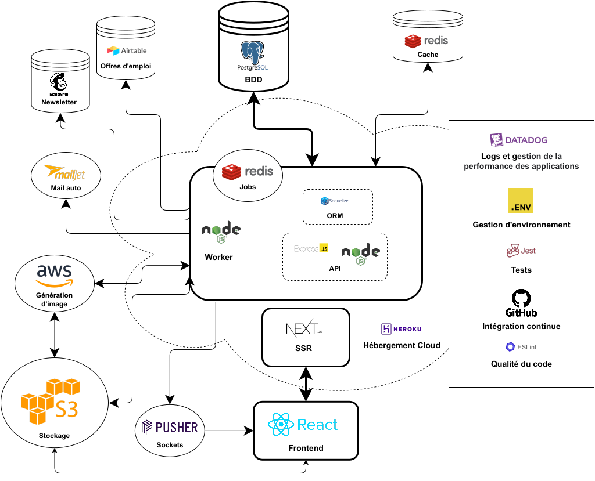

# Entourage Pro — Front

[![Entourage Pro [front-end]](https://github.com/ReseauEntourage/entourage-job-front/actions/workflows/ci.yml/badge.svg)](https://github.com/ReseauEntourage/entourage-job-front/actions/workflows/ci.yml)

Frontend de **Entourage Pro**, le premier réseau professionnel solidaire : une plateforme qui met en relation des personnes en recherche d'emploi (candidats), des bénévoles qui les accompagnent (coachs), des prescripteurs sociaux et des entreprises engagées.

Application **Next.js 16 / React 19 / TypeScript**, consommant l'API REST du repo [`entourage-job-back`](https://github.com/ReseauEntourage/entourage-job-back).

---

## Sommaire

- [Versions principales](#versions-principales)
- [Démarrage rapide](#démarrage-rapide)
- [Scripts](#scripts)
- [Architecture](#architecture)
- [Système de composants](#système-de-composants)
- [État applicatif (Redux Toolkit + RTK Query)](#état-applicatif-redux-toolkit--rtk-query)
- [Rôles et permissions de routes](#rôles-et-permissions-de-routes)
- [Variables d'environnement](#variables-denvironnement)
- [Configuration TypeScript](#configuration-typescript)
- [Tests](#tests)
- [Storybook et icônes](#storybook-et-icônes)
- [Qualité de code](#qualité-de-code)
- [CI/CD et déploiement](#cicd-et-déploiement)
- [Maintenance](#maintenance)
- [Documentation complémentaire](#documentation-complémentaire)

---

## Versions principales

| Outil | Version |
| --- | --- |
| **Node** | 24.x (`.nvmrc` : 24.15.0) |
| **pnpm** | 11.15.1 |
| **Next.js** | 16.2.12 (Pages Router, Turbopack) |
| **React** | 19.2.8 |
| **TypeScript** | 6.x |
| **Redux Toolkit** | 2.12 (avec RTK Query) |
| **ESLint** | 9 (flat config) |
| **Storybook** | 10.3 |
| **Cypress** | 15.19 |
| **Jest** | 30.4 |

---

## Démarrage rapide

**Prérequis** : Node.js `24.15.0` (voir `.nvmrc`) et **pnpm 11** — `npm install` échoue sur ce projet, utilisez toujours pnpm.

```bash
nvm use                  # Node 24.15.0
corepack enable          # active pnpm à la version déclarée dans packageManager
pnpm install

cp .env.dist .env        # puis renseigner les valeurs (voir plus bas)
pnpm run dev             # http://localhost:3000 (Next.js + Turbopack)
```

Le front attend l'API sur `NEXT_PUBLIC_API_URL` (par défaut `http://localhost:3002`) : lancez `entourage-job-back` en parallèle.

---

## Scripts

| Commande | Description |
| --- | --- |
| `pnpm run dev` | Serveur de dev Next.js (Turbopack) sur le port 3000 |
| `pnpm run build` | Build de production (Turbopack) |
| `pnpm start` | Sert le build de production |
| `pnpm test` | Enchaîne `test:ts-check`, `test:eslint`, `test:unit`, `test:e2e` |
| `pnpm run test:ts-check` | `tsc --noEmit` sur `tsconfig.base.json` |
| `pnpm run test:eslint` | ESLint sur `src/`, `--fix`, `--max-warnings=0` |
| `pnpm run test:unit` | Jest (jsdom + Testing Library) |
| `pnpm run cypress:local` | Ouvre le runner Cypress en local |
| `pnpm run cypress:io` | Lance Cypress en headless et enregistre le run sur Cypress Cloud |
| `pnpm run storybook` | Storybook sur le port 6006 |
| `pnpm run build-storybook` / `chromatic` | Build statique Storybook / publication Chromatic |
| `pnpm run format` | Prettier sur l'ensemble du repo |
| `pnpm run add-icons` | Régénère les icônes SVG depuis `assets/icons` |

---

## Architecture

Le projet utilise le **Pages Router** de Next.js. Les fichiers de `src/pages/` sont de fines coquilles : elles montent un layout et délèguent la logique métier à une *feature*.

```
src/
├── pages/          Routing Next.js — pages fines, quasi sans logique
├── features/       Écrans et blocs métier (backoffice, profile, wizard, login, forms…)
├── components/     Système de composants
│   ├── ui/         Primitives génériques réutilisables
│   └── layouts/    Layout public et Layout backoffice
├── use-cases/      Domaines métier Redux (authentication, messaging, profiles…)
├── store/          Configuration du store, RTK Query, listener middleware, utilitaires de test
├── api/            Client Axios (`APIHandler`), types de l'API, intercepteurs
├── hooks/          Hooks transverses (authentification, filtres, upload, query params…)
├── constants/      Design tokens, départements, tags, rôles, partenaires…
├── styles/         GlobalStyle, feuille CSS de base, `shouldForwardProp`
├── utils/          Helpers purs (formatage, tri, filtres, redirections…)
└── proxy.ts        En-têtes CORS côté serveur Next
```

### Découpage par domaine

| Zone | Contenu |
| --- | --- |
| **Site public** | Page d'accueil, `/candidats`, `/aider`, `/entreprises/*`, `/travailler`, CGU / mentions légales, CV public `/cv/[userId]` |
| **Backoffice** | `/backoffice/*` — tableau de bord, annuaire du réseau, profils, messagerie, événements, ressources, paramètres, espaces prescripteur, entreprise et admin |
| **Parcours d'entrée** | Inscription, vérification d'email, reset de mot de passe, callback LinkedIn, wizard d'onboarding (`/wizard`) |

### Communication avec l'extérieur

- **API back** : Axios via la classe `APIHandler` (`src/api/api.ts`), token d'auth injecté par intercepteur, routes et DTO typés dans `src/api/types.ts`.
- **Temps réel** : Pusher (`pusher-js`) pour la messagerie et les notifications.
- **Médias** : images et documents servis depuis S3 / CloudFront (`NEXT_PUBLIC_CDN_URL`, `NEXT_PUBLIC_AWSS3_CDN_URL`), déclarés dans `images.remotePatterns` de `next.config.mjs`.
- **Monitoring** : Datadog RUM côté navigateur, `dd-trace` côté SSR ; Google Analytics et Facebook Pixel derrière le bandeau de consentement Tarte au Citron.

> ⚠️ Toute modification d'un contrat d'API doit être faite **en parallèle** dans `entourage-job-back` et dans `src/api/types.ts` + le domaine `use-cases/` concerné.

---

## Système de composants

**Règle centrale : on n'écrit jamais de balise HTML brute dans du code métier.** Deux couches :

| Couche | Emplacement | Rôle |
| --- | --- | --- |
| Primitives UI | `src/components/ui/` | Génériques et réutilisables : `Button`, `Text`, `Headings`, `Inputs`, `Cards`, `Tag`, `Badge`, `Alert`, `Spinner`, `Skeleton`, `Tooltip`, `Dropdown`, `Accordion`, `Table`, `SvgIcon`… |
| Composants métier | `src/components/`, `src/features/` | Spécifiques à l'application : composent les primitives et portent la logique domaine |

Import depuis le barrel : `import { Button, Text, Spinner } from '@/src/components/ui';`

### Convention styled-components

Un composant = un dossier, trois fichiers :

```
ComponentName/
├── ComponentName.tsx         # logique React
├── ComponentName.styles.ts   # styled-components, nommés Styled<ComponentName>
├── ComponentName.types.ts    # types TS (si non triviaux)
└── index.ts                  # ré-exports
```

- Les tokens de design viennent de `src/constants/styles` (`COLORS`, `FONT_WEIGHTS`, `BREAKPOINTS`, `HEIGHTS`) — **jamais de valeur hexadécimale en dur**.
- Les styles conditionnels passent par des fonctions `${({ prop }) => …}`, pas par des bascules de `className`.
- `:hover` / `:disabled` sont définis dans le styled-component.
- **Aucun appel `styled(...)` inline dans un `.tsx`**, même pour les composants qui ne sont pas dans leur propre dossier : toujours un `.styles.ts` voisin. Une règle ESLint maison (`eslint-rules/no-untransient-styled-props.mjs`) complète le garde-fou sur les props transientes.

Avant de créer un composant : vérifier qu'une primitive ne couvre pas déjà le besoin ; si une variante manque, l'ajouter à la primitive plutôt que de la forker.

### Héritage UIkit (en cours de suppression)

> ⚠️ **UIkit 3.6.22 est en cours de suppression progressive.** Aucun nouveau code ne doit l'utiliser.

Il subsiste :

- les bundles compilés dans `src/styles/dist/` (CSS et JS UIkit, dont un build d'icônes custom) ;
- quelques imports résiduels du package `uikit` (`src/components/ui/Grid.tsx`, `src/components/ui/Carousel/`, `src/hooks/useUploadImage.ts`) ;
- des classes `uk-*` encore présentes dans certains composants, notamment les navigations (`src/features/navs/`).

Toute reprise de ces zones est l'occasion de les migrer vers les primitives de `src/components/ui/` et styled-components.

### Langue

Les commentaires et la JSDoc sont **en anglais**. Les textes affichés à l'utilisateur sont **en français** — c'est voulu.

---

## État applicatif (Redux Toolkit + RTK Query)

Le store est assemblé dynamiquement à partir des domaines déclarés dans `src/use-cases/index.ts` : chaque domaine expose un `slice`, tous sont agrégés par `combineReducers` dans `src/store/store.ts`, aux côtés du reducer RTK Query.

Un domaine ressemble à ceci :

```
src/use-cases/authentication/
├── authentication.slice.ts       # état local du domaine (createSlice)
├── authentication.api.ts         # endpoints RTK Query (api.injectEndpoints)
├── authentication.listeners.ts   # effets de bord (listener middleware)
├── authentication.selectors.ts   # sélecteurs publics
├── authentication.adapters.ts    # createRequestAdapter / createEntityAdapter
├── *.spec.ts                     # tests unitaires du domaine
└── index.ts                      # API publique du domaine
```

Points structurants :

- **Une seule instance RTK Query** pour toute l'application (`src/store/api/api.slice.ts`). Chaque domaine ajoute ses endpoints via `api.injectEndpoints({...})` — on ne crée jamais un second `createApi()`.
- Elle utilise `fakeBaseQuery()` : chaque endpoint appelle `Api.*` (l'instance Axios existante) depuis son `queryFn` / `mutationFn`, ce qui préserve l'authentification et les intercepteurs plutôt que de les réimplémenter dans un `baseQuery`.
- Les effets de bord passent par le **listener middleware** de RTK (`src/store/listenerMiddleware.ts`) — les sagas ont été retirées.
- Un domaine peut n'avoir **aucun slice** s'il est entièrement porté par RTK Query (ex. `profile-completion`) : il est alors importé pour son seul effet de bord d'enregistrement.
- `createRequestAdapter` (`src/store/utils/`) génère les actions `requested` / `succeeded` / `failed` / `reset` et les sélecteurs associés pour les requêtes encore gérées en slice.
- `src/store/testUtils/` fournit `createTestStore`, `renderWithProviders`, `mockApi` et `seedAccessToken` pour tester composants et domaines.

Côté React : `useSelector` sur les sélecteurs exportés par le domaine, `useDispatch` pour les actions, hooks RTK Query générés pour les endpoints.

---

## Rôles et permissions de routes

Quatre rôles (`src/constants/users.ts`) : `Candidat`, `Coach`, `Prescripteur`, `Admin`.

Les accès sont décrits dans `src/hooks/authentication/permissions.ts` sous forme d'un tableau évalué **dans l'ordre** :

```ts
{
  paths: ['/backoffice/parametres'],
  roles: [UserRoles.ADMIN, UserRoles.CANDIDATE],
}
```

- Un `path` matche par préfixe (`/backoffice` couvre tout le backoffice).
- `roles: '*'` autorise tous les utilisateurs **connectés**.
- Une route absente de tous les `paths` est **publique**.
- En cas de refus : redirection vers la route par défaut du rôle (`src/utils/Redirects.ts`), ou vers l'accueil si l'utilisateur n'est pas connecté.

Détails dans [`docs/routes-permissions.md`](docs/routes-permissions.md).

---

## Variables d'environnement

Partir de [`.env.dist`](.env.dist). Grandes familles :

| Famille | Variables |
| --- | --- |
| Général | `NEXT_PUBLIC_SERVER_URL`, `NEXT_PUBLIC_API_URL`, `NEXT_PUBLIC_ENV`, `PORT` |
| Médias / CDN | `NEXT_PUBLIC_CDN_URL`, `NEXT_PUBLIC_AWSS3_URL`, `NEXT_PUBLIC_AWSS3_CDN_URL`, `NEXT_PUBLIC_AWSS3_IMAGE_DIRECTORY` |
| Temps réel | `NEXT_PUBLIC_PUSHER_API_KEY` |
| Monitoring | `NEXT_PUBLIC_DD_APP_ID`, `NEXT_PUBLIC_DD_CLIENT_TOKEN`, `DD_SERVICE`, `DD_ENV`, `NEXT_PUBLIC_GA_TRACKING_ID` |
| Consentement / social | `NEXT_PUBLIC_TARTEAUCITRON_UUID`, `NEXT_PUBLIC_FB_APP_ID`, `NEXT_PUBLIC_FB_DOMAIN_VERIFICATION` |
| Modération | `NEXT_PUBLIC_LINKIFY_SAFE_DOMAINS`, `NEXT_PUBLIC_MESSAGING_FORBIDDEN_EXPRESSIONS` |
| Contenus externes | `NEXT_PUBLIC_TOOLBOX_*_URL`, `NEXT_PUBLIC_URL_MESURE_D_IMPACT`, `NEXT_PUBLIC_URL_COACH_COMPANY_KIT`, `NEXT_PUBLIC_DONATION_LINK`, `NEXT_PUBLIC_PINNED_COMMUNICATION_*` |
| Divers | `NEXT_PUBLIC_DATA_INCLUSION_TOKEN`, `NEXT_PUBLIC_MAILJET_CONTACT_EMAIL`, `NEXT_PUBLIC_SHOW_POPUP`, `NEXT_PUBLIC_WOMENS_DAY` |
| Tests / hébergement | `CYPRESS_IO_KEY`, `CYPRESS_IO_PROJECT_ID`, `HEROKU_RELEASE_VERSION`, `HEROKU_RELEASE_COMMIT` |

> Les variables `NEXT_PUBLIC_*` sont **inlinées dans le bundle navigateur** au build : elles ne doivent jamais contenir de secret.

---

## Configuration TypeScript

`src/` et `cypress/` ont besoin d'options différentes (`isolatedModules` notamment). Le projet utilise donc **trois `tsconfig`** :

| Fichier | Rôle |
| --- | --- |
| `tsconfig.base.json` | Base commune à la racine : `strict`, alias `@/*`, types `cypress` + `jest` + `node` |
| `src/tsconfig.json` | Étend la base pour l'application (`isolatedModules: true`), utilisé par le build Next (`typescript.tsconfigPath` dans `next.config.mjs`) et redéclare `paths` pour la transformation SWC de `next/jest` |
| `cypress/tsconfig.json` | Étend la base pour les tests E2E (`isolatedModules: false`) |
| `tsconfig.stories.json` | Étend la base pour les fichiers Storybook |

Le type-check global (app + cypress) se lance avec :

```bash
pnpm run test:ts-check
```

---

## Tests

**Unitaires — Jest + Testing Library**

```bash
pnpm run test:unit
pnpm run test:unit -- src/use-cases/messaging     # cibler un domaine
pnpm run test:unit -- --watch                     # mode watch
pnpm run test:unit -- --coverage                  # génère le dossier coverage/ (rapport HTML dans coverage/lcov-report)
```

Les tests vivent à côté du code (`*.spec.ts`, `*.spec.tsx`). Pour un composant connecté, utiliser `renderWithProviders` de `src/store/testUtils/`. Les SVG sont stubés via `__mocks__/svg.js`.

**End-to-end — Cypress**

```bash
pnpm run cypress:local   # runner interactif, nécessite le front lancé
pnpm run cypress:io      # headless + enregistrement Cypress Cloud
```

Specs dans `cypress/e2e/`, fixtures dans `cypress/fixtures/` — voir [`cypress/README.md`](cypress/README.md). Viewport 1920×1080, 3 retries.

---

## Storybook et icônes

Les composants de l'application sont documentés dans un Storybook (`src/**/*.stories.tsx`), avec régression visuelle via Chromatic.

```bash
pnpm run storybook         # http://localhost:6006
pnpm run build-storybook   # build statique
pnpm run chromatic         # publication et diff visuel
```

Après avoir ajouté une icône SVG dans `assets/icons/`, régénérer le catalogue pour qu'elle soit disponible dans le code et dans Storybook :

```bash
pnpm run add-icons
```

---

## Qualité de code

- **TypeScript strict** — `pnpm run test:ts-check` ; la config Next pointe sur `src/tsconfig.json`, le check global sur `tsconfig.base.json`.
- **ESLint 9** (flat config, `eslint.config.mjs`) : TypeScript, React, react-hooks, jsx-a11y, import-x, jest, Prettier, plus les règles maison de `eslint-rules/`. Zéro warning toléré.
- **Prettier** — `pnpm run format`.
- **Husky + lint-staged** : un hook `pre-commit` lance le type-check et ESLint `--fix` sur les fichiers modifiés. En cas de blocage sur le hook, `git commit --no-verify` permet de le contourner — à réserver aux cas exceptionnels, la CI rejouera les mêmes vérifications.

---

## CI/CD et déploiement

**GitHub Actions** (`.github/workflows/`)

- `ci.yml` — sur `master`, `develop` et chaque PR : type-check, lint, build et tests unitaires en parallèle, puis E2E Cypress sur Chrome (enregistré sur Cypress Cloud uniquement depuis `develop`).
- `release.yml` — sur les PR vers `master` : bump de version et tag.
- `storybook.yml` — build et publication Storybook.

**Hébergement** — Heroku, `Procfile` : `web: pnpm start`. Le build est servi avec un `assetPrefix` pointant sur le CDN en production. `next.config.mjs` ajoute les en-têtes de sécurité (HSTS, `X-Frame-Options`, `Referrer-Policy`, `Permissions-Policy`…) et quelques redirections (`/don`, `/boite-a-outils`, `/linkedout`).

**Environnements** — le déploiement est automatique après merge :

| Branche | Environnement | URL |
| --- | --- | --- |
| `develop` | Pré-production | https://entourage-job-front-preprod.herokuapp.com |
| `master` | Production | https://entourage-pro.fr |

Le flux habituel : branche de feature → PR vers `develop` → validation en pré-production → PR de `develop` vers `master` (qui déclenche le bump de version et le tag).

---

## Maintenance

Périodiquement, détecter les dépendances, imports et exports devenus inutilisés :

```bash
pnpm dlx dead-exports
```

---

## Documentation complémentaire

| Fichier | Contenu |
| --- | --- |
| [`docs/use-cases.md`](docs/use-cases.md) | Anatomie d'un domaine Redux et intégration côté React |
| [`docs/messaging.md`](docs/messaging.md) | Fonctionnement détaillé de la messagerie (Pusher, conversations, modération) |
| [`docs/routes-permissions.md`](docs/routes-permissions.md) | Système de permissions des routes |
| [`LIBRARIES.md`](LIBRARIES.md) | Inventaire commenté des dépendances |
| [`MOCKUP.md`](MOCKUP.md) | Langage visuel de l'application, pour générer des maquettes fidèles |
| [`CLAUDE.md`](CLAUDE.md) | Conventions destinées aux assistants de code |
| [`cypress/README.md`](cypress/README.md) | Organisation et conventions des tests E2E |

## Stack technique



---

## Licence

MIT — voir [`LICENSE`](LICENSE).
